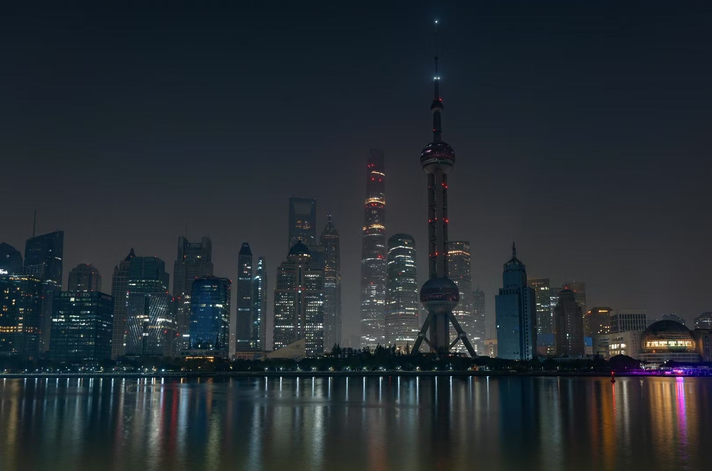
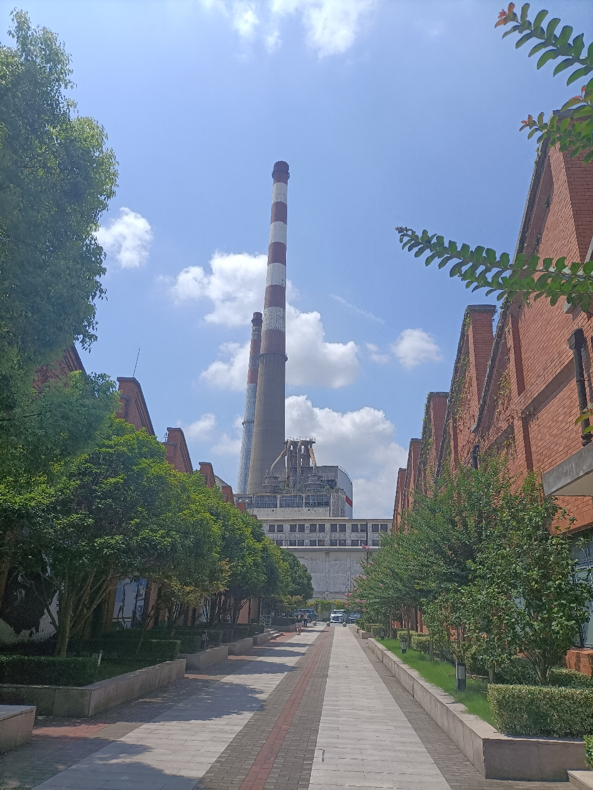
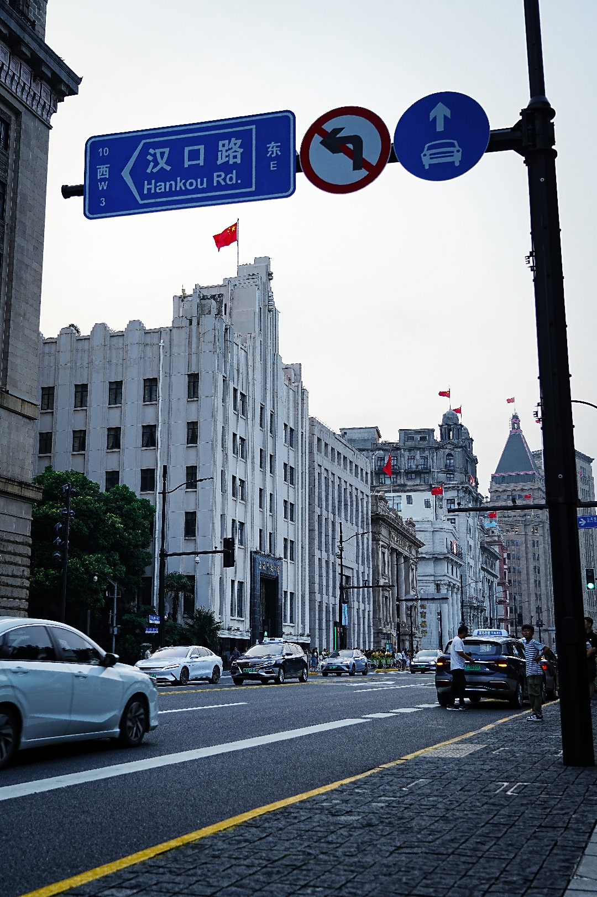
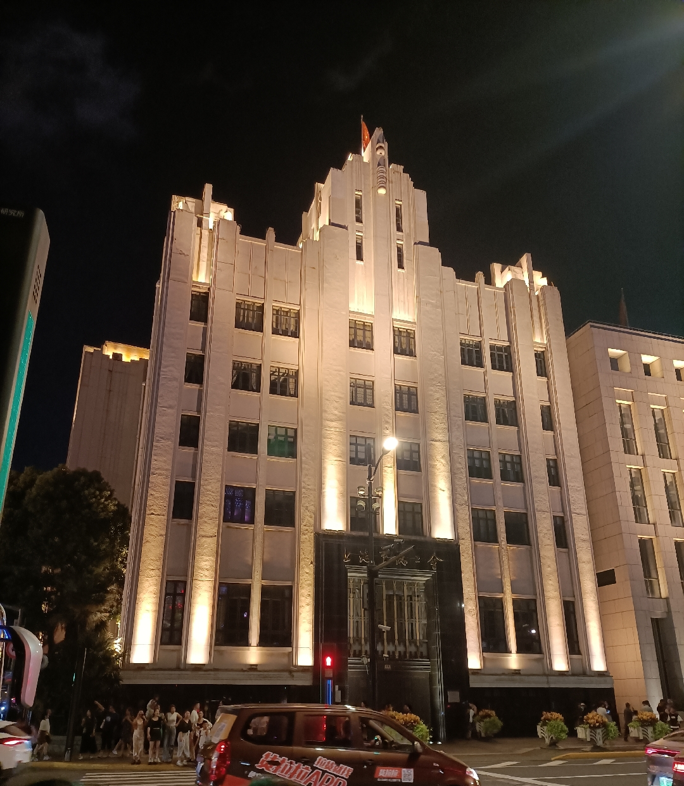
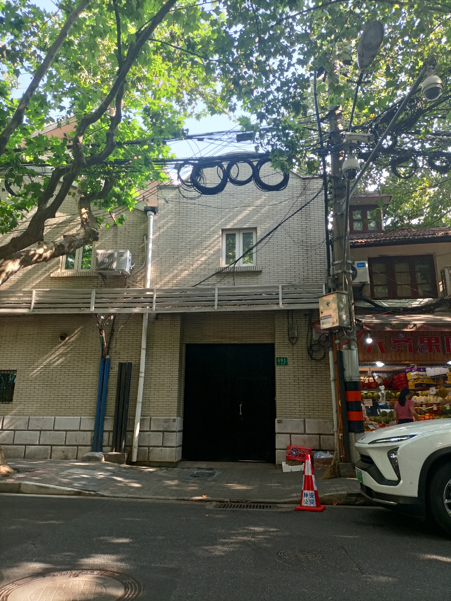
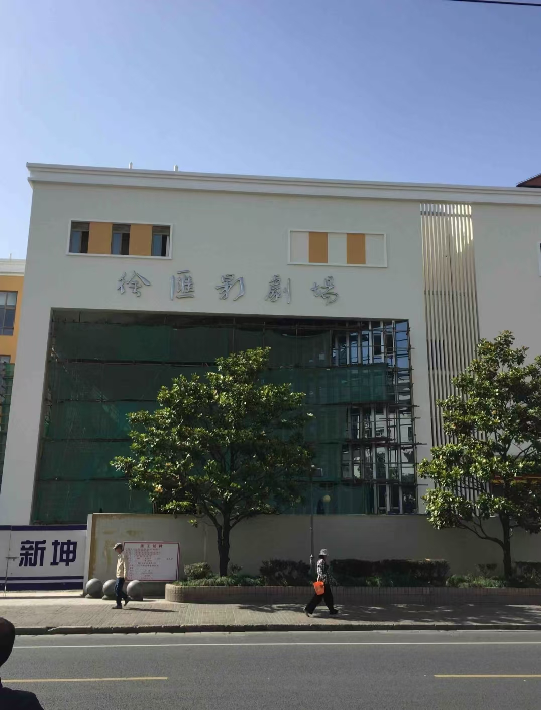
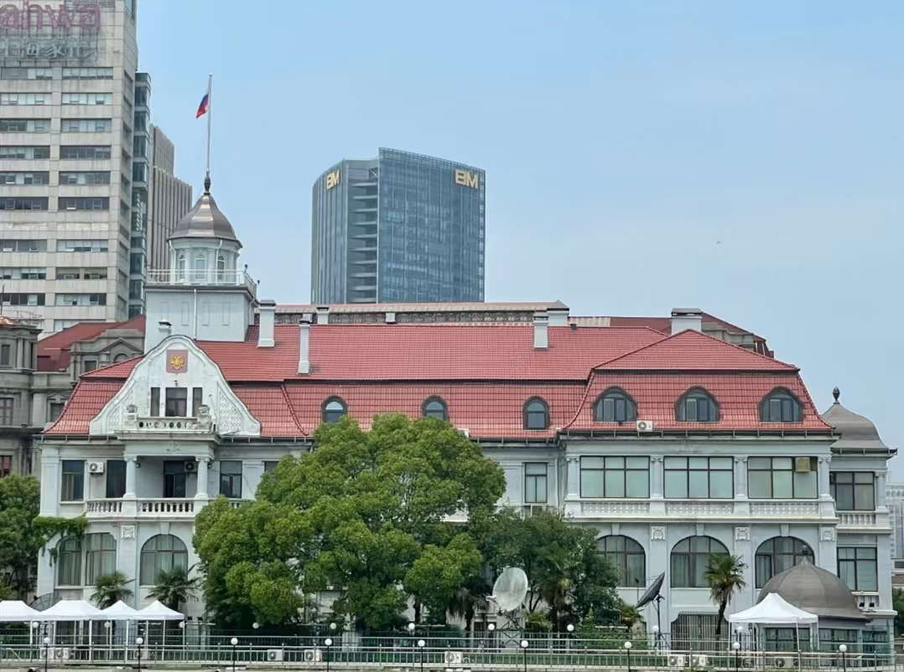

## 2025上海之旅

- 外滩

  

           

           

               </a>
               </a>
           

       

- 国棉十七厂（上海国际时尚中心）

    

        

        

            
            
        

    

- 上海市总工会

    

        

        

            
            
        

    

- 工总司成立会

    

        

        

            
        

    

- 家

    

        

        

            
            
        

    

- 上海文化广场

    

        

        

            
        

    

- 友谊会堂

    

        

        

            
        

    

- 徐汇剧院

    

        

        

            
        

    

- 上海市民兵指挥部（俄罗斯总领事馆）

    

        

        

            
        

    

- 中苏友好大厦（上海展览馆）

    

        

        

            
        

    

  

  

  

  

  

  

  

  

  

  

  
