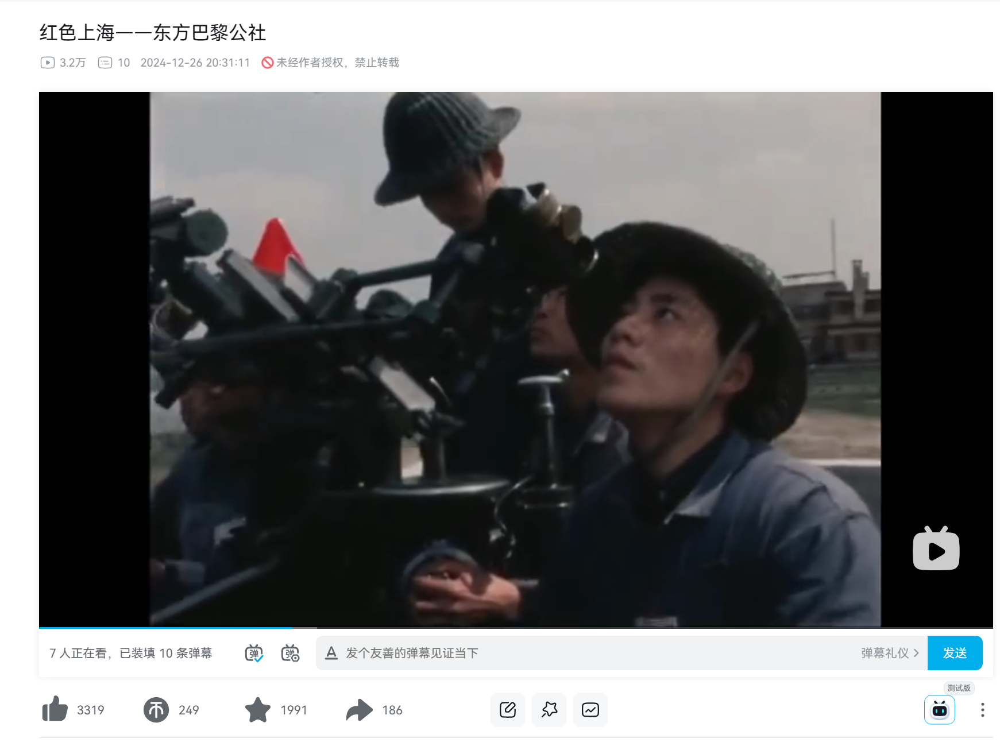

## 《愚公移山》

这部纪录片介绍了 1975 年中国等地的生活与工作情形，展现了中国在 cr 时期的革命经验和时间建设，为 cr

 的最后时期留下了宝贵的影像。

讲学校那集至今令我印象深刻，原来学校曾经是这样的，师生之间是民主的关系，而不是与生俱来的老师压倒和批评学生。

我将讲上海的三集剪辑了一下，在 bilibili 上投放， 收获了可观的数据。

 

         

         

             
         

     

